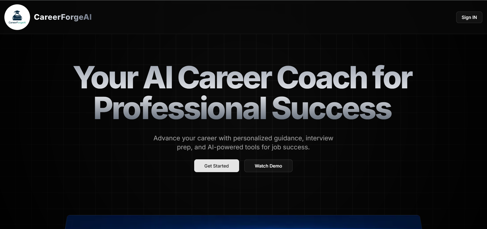

<div align="center">

# CareerForgeAI

### AI-Powered Career Growth Platform

[](https://nextjs.org/)
[](https://reactjs.org/)
[](https://langchain.com/)
[](https://neon.tech/)
[](https://prisma.io/)
[](https://openrouter.ai/)
[](https://career-forge-ai-one.vercel.app/)

<br/>

**[🔗 Live Demo](https://career-forge-ai-one.vercel.app/) · [📂 Repository](https://github.com/Piyushratn/CareerForgeAI) · [🐛 Report Bug](https://github.com/Piyushratn/CareerForgeAI/issues) · [✨ Request Feature](https://github.com/Piyushratn/CareerForgeAI/issues)**

</div>

---

## 📌 The Problem

> Job seekers spend 50+ hours preparing for interviews, still get rejected because their resumes don't pass ATS filters, and have no personalized guidance on what skills they actually need to develop for their target role.

**CareerForgeAI solves all three** — one platform that handles resume building, interview preparation, and career roadmapping using real AI, not templates.

---

## 📊 Impact

<div align="center">

| 🌐 Industries Supported | 🧠 Interview Questions | ⚡ Prep Time Reduced | 📄 Shortlist Rate Increase | 🚀 Users Helped |
|:---:|:---:|:---:|:---:|:---:|
| **50+** | **1000+** | **60%** | **40%** | **Growing** |

</div>

---

## ✨ Features

| Feature | Description |
|---------|-------------|
| 🤖 **AI Interview System** | 1000+ questions across 50+ industries with real-time AI feedback |
| 📄 **ATS Resume Builder** | AI generates ATS-optimized resumes tailored to job descriptions |
| ✉️ **Cover Letter Generator** | LangChain-powered cover letters customized per role |
| 🧠 **Skill Gap Analysis** | AI identifies missing skills and creates a learning plan |
| 🗺️ **Career Roadmap** | Personalized step-by-step roadmap from current role to target role |
| 📊 **Performance Dashboard** | Track interview scores, progress, and improvement over time |
| ⚡ **Background Jobs** | Inngest handles async AI tasks — no timeouts, no blocking |

---

## 🖼️ Screenshots

> **Dashboard — Career Overview**



> *(Add more screenshots: interview mode, resume builder, roadmap view)*

---

## 🏗️ System Architecture

```
┌─────────────────────────────────────────────────────────────────┐
│                        USER INTERFACE                            │
│              Next.js App Router + Tailwind CSS                   │
│   [ Dashboard ] [ Interview ] [ Resume ] [ Roadmap ] [ Skills ]  │
└────────────────────────┬────────────────────────────────────────┘
                         │ User Actions
                         ▼
┌─────────────────────────────────────────────────────────────────┐
│                    NEXT.JS API ROUTES                            │
│         /api/interview  /api/resume  /api/roadmap               │
└──────────┬──────────────────────────────────┬───────────────────┘
           │                                  │
           ▼                                  ▼
┌──────────────────────┐          ┌───────────────────────────────┐
│   INNGEST WORKERS    │          │        LANGCHAIN PIPELINE      │
│  Async background    │          │  • Prompt Engineering          │
│  job processing      │          │  • RAG-based context retrieval │
│  No API timeouts     │          │  • Skill gap analysis logic    │
│  Event-driven        │          │  • Resume content generation   │
└──────────┬───────────┘          └──────────────┬────────────────┘
           │                                     │
           └──────────────┬──────────────────────┘
                          │
                          ▼
┌─────────────────────────────────────────────────────────────────┐
│                    OPENROUTER API (LLM)                          │
│         Routes to best available AI model dynamically           │
│      Interview Q&A · Resume Writing · Roadmap Generation        │
└──────────────────────────┬──────────────────────────────────────┘
                           │
                           ▼
┌─────────────────────────────────────────────────────────────────┐
│               DATABASE LAYER (NeonDB + Prisma ORM)              │
│     Users · Resumes · Interview Sessions · Progress Data        │
│          PostgreSQL on Neon — serverless, scalable              │
└─────────────────────────────────────────────────────────────────┘
```

---

## 🛠️ Tech Stack

### Frontend


### Backend


### Database


### AI / GenAI


### Deployment


---

## 📁 Project Structure

```
CareerForgeAI/
├── app/
│   ├── (main)/
│   │   ├── dashboard/         # Main user dashboard
│   │   ├── interview/         # AI interview system
│   │   ├── resume/            # ATS resume builder
│   │   └── roadmap/           # Career roadmap generator
│   ├── api/
│   │   ├── interview/         # Interview Q&A endpoints
│   │   ├── resume/            # Resume generation endpoints
│   │   └── roadmap/           # Roadmap generation endpoints
│   └── layout.js
├── actions/                   # Server actions
├── components/                # Reusable UI components
├── data/                      # Static data (industries, questions)
├── hooks/                     # Custom React hooks
├── lib/
│   ├── langchain.js           # LangChain pipeline setup
│   ├── prisma.js              # Prisma client
│   └── inngest.js             # Background job definitions
├── prisma/
│   └── schema.prisma          # Database schema
├── public/                    # Static assets
├── inngest.config.js          # Inngest worker config
├── next.config.mjs
└── package.json
```

---

## ⚙️ Setup & Installation

### Prerequisites
- Node.js v18+
- NeonDB account (free) → [neon.tech](https://neon.tech)
- OpenRouter API key → [openrouter.ai](https://openrouter.ai)
- Inngest account (free) → [inngest.com](https://inngest.com)

### 1. Clone the repository

```bash
git clone https://github.com/Piyushratn/CareerForgeAI.git
cd CareerForgeAI
```

### 2. Install dependencies

```bash
npm install
```

### 3. Configure environment variables

Create a `.env` file in the root:

```env
# Database
DATABASE_URL=your_neondb_connection_string

# AI
OPENROUTER_API_KEY=your_openrouter_api_key

# Inngest
INNGEST_EVENT_KEY=your_inngest_event_key
INNGEST_SIGNING_KEY=your_inngest_signing_key

# App
NEXT_PUBLIC_APP_URL=http://localhost:3000
```

### 4. Set up the database

```bash
npx prisma generate
npx prisma db push
```

### 5. Run the development server

```bash
npm run dev
```

Open [http://localhost:3000](http://localhost:3000)

### 6. Run Inngest dev server (separate terminal)

```bash
npx inngest-cli@latest dev
```

---

## 🎯 How to Use

**Step 1 — Set up your profile**
Enter your current role, target role, years of experience, and industry.

**Step 2 — Get your Career Roadmap**
AI generates a personalized step-by-step path from where you are to where you want to be.

**Step 3 — Practice Interviews**
Choose your industry and role → AI asks questions → get real-time feedback on your answers.

**Step 4 — Build your Resume**
Enter your details → AI generates an ATS-optimized resume tailored to your target job description.

**Step 5 — Generate Cover Letter**
Select a job posting → AI writes a customized cover letter in seconds.

**Step 6 — Track Progress**
Dashboard shows your interview scores, skill gaps closed, and improvement over time.

---

## 🔐 Security

- All API keys stored as environment variables — never hardcoded
- `.env` excluded via `.gitignore`
- Prisma ORM prevents SQL injection by design
- Inngest event signing key validates webhook authenticity

---

## 🚀 Key Engineering Highlights

- **Inngest for async AI jobs** — long-running LangChain tasks run as background jobs, preventing Vercel's 10-second timeout limit from killing AI responses
- **Prisma + NeonDB** — type-safe database queries with a serverless PostgreSQL backend that scales to zero when idle
- **RAG-powered skill gap analysis** — user profile data is used as retrieval context, making roadmaps specific to the individual rather than generic
- **Prompt engineering per feature** — each feature (interview, resume, roadmap) uses a separately tuned system prompt for maximum output quality

---

## 🗺️ Roadmap

- [ ] LinkedIn profile import for auto-filling resume data
- [ ] Mock interview with voice input (speech-to-text)
- [ ] Job board integration — match resumes to real job listings
- [ ] Team/enterprise plan — HR teams can assess candidates
- [ ] Mobile app (React Native)

---

## 👨‍💻 Author

**Piyush Ratn** — AI-Focused Full-Stack Developer

[](https://linkedin.com/in/piyush-ratn)
[](https://github.com/Piyushratn)
[](mailto:piyushratn932@gmail.com)
[](https://github.com/Piyushratn)

---

## 📄 License

This project is open source and available under the [MIT License](LICENSE).

---

<div align="center">

⭐ **If CareerForgeAI helped you, consider giving it a star!** ⭐

*Built with ❤️ by [Piyush Ratn](https://github.com/Piyushratn)*

</div>
